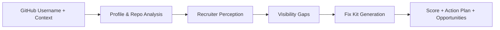

# 🚀 LeverageOS

## 💼 Turn Public GitHub Into Recruiter-Ready Signal

LeverageOS helps developers who have real technical work but weak public packaging.  
It analyzes a GitHub profile, simulates recruiter perception, identifies visibility gaps, and generates a practical fix kit the user can apply immediately.

**In one line:** LeverageOS helps developers look as strong publicly as they actually are technically.

---

## 🌐 Try It Live

**Live product:** [https://leverageos-ni61.onrender.com/](https://leverageos-ni61.onrender.com/)

What happens in the live app:

- ✍️ Enter a GitHub username
- 🧠 Add a short self-description and optional target role
- ⚡ Watch the analysis run live
- 📊 Get a score, recruiter-style verdict, and copy-ready improvement assets

---

## ❗ The Problem

Many strong developers are underrated because their public GitHub does not communicate their strengths clearly enough.

Most recruiters do not deeply inspect repositories. They scan for:

- 🎯 clear role fit
- 🧾 visible proof of work
- 🔁 consistent public signal
- 👀 strong first impression

If the packaging is weak, strong candidates can look average.

---

## ✨ The Product

LeverageOS is a developer reputation improvement product.

Instead of giving vague advice, it gives users output they can use immediately:

- 📈 a recruiter perception score
- 🗣 a recruiter-style explanation of what is working and what is not
- 🕳 the biggest visibility gaps
- 🛠 a GitHub-focused fix kit
- 🧵 profile copy for LinkedIn and X
- 📄 resume-ready bullets
- 🗓 a 30-day action plan
- 🔍 opportunity suggestions

**Goal:** help developers convert existing proof into stronger public positioning.

---

## 🎁 What Users Get

After one analysis, users receive:

- **📊 Score and verdict**  
  A fast recruiter-style summary of how their public profile currently lands.

- **🛠 GitHub Fix Now Kit**  
  Better bio, profile README, repo descriptions, and pinned repo strategy.

- **📣 Career packaging assets**  
  LinkedIn headline, LinkedIn About, social post ideas, X thread, and outreach copy.

- **📄 Resume-ready bullets**  
  Stronger framing of shipped work that can be reused in applications.

- **🗺 30-day action plan**  
  A practical path to improve discoverability and credibility over time.

---

## 🧠 Why It Stands Out

LeverageOS is powered by a **6-agent pipeline**, but the user experience stays simple.

Behind the scenes it:

1. 🔎 gathers public technical proof
2. 👔 interprets it like a recruiter would
3. ⚠️ identifies visibility gaps
4. ✍️ generates fixes
5. 📊 scores public perception
6. 🌱 surfaces next-step opportunities

The multi-agent system is the differentiator.  
The user-facing value is faster clarity, stronger positioning, and immediate actionability.

---

## 🔄 Product Workflow



---

## 👥 Who This Is For

- 🎓 students and early-career developers with projects but weak profile presentation
- 💼 job-seeking engineers who want stronger recruiter response
- 🧑‍💻 builders with good repos but poor discoverability
- 🚀 freelancers and indie hackers who need better public trust signals

---

## 💥 Why It Matters

LeverageOS does not stop at diagnosis.

It translates public developer work into:

- clearer communication
- stronger recruiter perception
- better discoverability
- immediately usable fixes

That makes it more than an analytics tool. It is a practical developer reputation optimizer.

---

## 🏗 Architecture Overview

### 📦 Product flow

- user submits GitHub username and context
- backend runs a 6-agent orchestration pipeline
- progress streams live through SSE
- final report is generated and stored in memory for fast retrieval
- README content can be pushed directly to the GitHub profile repository

### 🛠 Core stack

- **Frontend:** Next.js 16, React 19, TypeScript
- **Backend:** Next.js Route Handlers on Node runtime
- **AI layer:** OpenAI SDK with OpenAI-compatible provider support
- **Primary provider:** Groq via `OPENAI_BASE_URL`
- **Data source:** GitHub REST API
- **Deployment:** Render free tier

---

## 🎯 Live Experience

The current deployed product includes:

- ⚡ live analysis progress stream
- 👔 recruiter-style report
- 📊 score shown early in the final output
- 📚 concise, easier-to-read report sections
- ✍️ copy-ready fix assets
- 📄 direct profile README apply flow

---

## 🏆 For Hackathon Judges

LeverageOS is designed to score strongly on:

- **🛠 Technical Execution**  
  Real multi-step pipeline, live deployment, SSE streaming, GitHub integration, and safe public API handling.

- **✅ Problem Solving & Usefulness**  
  Solves a real developer problem: weak public positioning despite strong work.

- **🎨 Creativity & Originality**  
  Frames developer reputation as a fixable systems problem, not just a profile-writing problem.

- **🤖 Usage of Codex & OpenAI Tools**  
  Codex was used to harden the backend, improve UX, shape deliverables, and ship the live product faster.

- **🎬 Demo & Presentation**  
  Clear flow: input → live analysis → practical output.

---

## 🗂 Repository Guide

```text
src/
|-- app/
|   |-- analyze/page.tsx
|   |-- analyzing/[jobId]/page.tsx
|   |-- report/[reportId]/page.tsx
|   `-- api/
|       |-- analyze/route.ts
|       |-- apply/readme/route.ts
|       |-- health/route.ts
|       |-- report/[reportId]/route.ts
|       `-- stream/[jobId]/route.ts
|-- components/
|   |-- CopyButton.tsx
|   |-- FixKitSection.tsx
|   `-- OpportunitySection.tsx
`-- lib/
    |-- agents/
    |-- env.ts
    |-- github.ts
    |-- jobStore.ts
    |-- orchestrator.ts
    |-- rateLimit.ts
    |-- resultCache.ts
    `-- validation.ts
```

---

## 🧪 Local Setup

### 📋 Prerequisites

- Node.js 20.9+
- OpenAI-compatible API key
- optional GitHub token for higher rate limits

### 📥 Install

```bash
npm install
```

### 🔐 Configure environment

Create `.env.local` from `.env.example`.

```env
OPENAI_API_KEY=your-provider-api-key
OPENAI_BASE_URL=https://api.groq.com/openai/v1
OPENAI_MODEL=llama-3.3-70b-versatile
GITHUB_TOKEN=github_pat_your_token_here
USE_WEB_SEARCH=true
```

### ▶️ Run

```bash
npm run dev
```

Open [http://localhost:3000](http://localhost:3000).

---

## 🚢 Deploying

LeverageOS is configured for deployment on a **single long-running Render web service**.

- Build command: `npm install && npm run build`
- Start command: `npm run start`
- Health check path: `/api/health`

Recommended environment variables:

- `OPENAI_API_KEY`
- `OPENAI_BASE_URL`
- `OPENAI_MODEL`
- `GITHUB_TOKEN`
- `USE_WEB_SEARCH`

---

## 🔧 Technical Details

This section is for developers who want implementation and operational context.

### 🛡 API hardening

- request validation for analyze payloads
- GitHub username validation before fetches
- safer error handling on public routes

### ⚙️ Runtime protections

- in-memory sliding-window IP rate limiting on `/api/analyze`
- 24-hour completed-result cache with `?fresh=1` bypass
- health endpoint for deployment monitoring

### 🧱 Hosting model

- optimized for a single long-running host
- current deployment target: Render free tier
- in-memory state means restart clears active memory-backed data

### 📝 Operational notes

- `GITHUB_TOKEN` is recommended for better GitHub API rate limits
- `web_search_preview` fallback behavior is preserved when provider support is limited
- README apply uses a user-provided GitHub PAT directly and does not persist it

---

## 📚 Additional Documentation

- [LeverageOS_Doc.pdf](/E:/HACKATHON/leverageos/LeverageOS_Doc.pdf)
- [PHASE1_STATUS.md](/E:/HACKATHON/leverageos/PHASE1_STATUS.md)

---

## 📄 License

MIT
