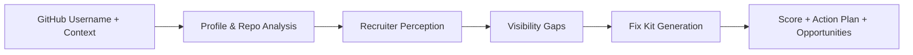

# LeverageOS

**Turn a developer's public GitHub into a recruiter-ready signal.**

LeverageOS helps developers who have real technical work but weak public packaging.  
It analyzes a GitHub profile, simulates recruiter perception, identifies visibility gaps, and generates a practical fix kit the user can apply immediately.

---

## Try It Live

**Live app:** [https://leverageos-ni61.onrender.com/](https://leverageos-ni61.onrender.com/)

What a visitor should expect:

- Paste a GitHub username
- Add a short self-description and optional target role
- Watch the analysis run live
- Get a score, recruiter-style verdict, and ready-to-use improvement assets

---

## The Problem

Many strong developers are undervalued because their public GitHub does not communicate their strengths clearly enough.

Recruiters usually do not deeply inspect repositories. They scan for:

- clear role fit
- visible proof of work
- consistent public signal
- strong first impression

If the profile packaging is weak, strong candidates can look average.

---

## The Product

LeverageOS is a product for developer reputation improvement.

Instead of giving generic advice, it gives users a structured output they can act on immediately:

- a recruiter perception score
- a fast explanation of what is working and what is not
- the biggest visibility gaps
- a GitHub-focused fix kit
- profile copy for LinkedIn/X
- resume bullets
- a 30-day action plan
- opportunity suggestions

The goal is simple:

**help developers convert existing proof into stronger public positioning.**

---

## What Users Get

After one analysis, users receive:

- **Score and verdict**
  A fast recruiter-style summary of how their public profile currently lands.

- **GitHub Fix Now Kit**
  Better bio, profile README, repo descriptions, and pinned repo strategy.

- **Career packaging assets**
  LinkedIn headline, LinkedIn About, social post ideas, X thread, and outreach copy.

- **Resume-ready bullets**
  A more legible summary of work that can be reused in job applications.

- **Action plan**
  A practical path to improve visibility over the next 30 days.

---

## Why It Stands Out

LeverageOS is powered by a **6-agent pipeline**, but the product experience is designed to feel simple for the user:

1. gather public technical proof
2. interpret it like a recruiter would
3. identify visibility gaps
4. generate fixes
5. score public perception
6. surface next opportunities

The multi-agent system is the differentiator behind the scenes.  
The user-facing value is a clearer, faster, more useful career signal.

---

## Product Workflow



---

## Example Use Cases

- A student or early-career developer who has projects but weak profile presentation
- A job-seeking engineer who wants stronger recruiter response
- A builder with good repos but poor discoverability
- A freelancer or indie hacker who needs better public trust signals

---

## Screenshots

Add product screenshots here for the final submission:

```text
/docs/screenshots/home.png
/docs/screenshots/analyzing.png
/docs/screenshots/report.png
```

Suggested screenshots:

1. Landing page / value proposition
2. Live analysis streaming view
3. Final report with score and fix kit

---

## Why It Matters

LeverageOS is useful because it does not stop at diagnosis.

It translates public developer work into:

- clearer communication
- stronger recruiter perception
- better discoverability
- immediately usable fixes

That makes it more than an analytics tool. It is a practical career signal optimizer.

---

## Architecture Overview

### Product flow

- user submits GitHub username and context
- backend runs a 6-agent orchestration pipeline
- progress streams live through SSE
- final report is generated and stored in memory for fast retrieval
- README content can be pushed directly to GitHub profile repo

### Core stack

- **Frontend:** Next.js 16, React 19, TypeScript
- **Backend:** Next.js Route Handlers on Node runtime
- **AI layer:** OpenAI SDK with OpenAI-compatible provider support
- **Primary provider:** Groq via `OPENAI_BASE_URL`
- **Data source:** GitHub REST API
- **Deployment:** Render free tier

---

## Live Experience

The current deployed app includes:

- live analysis progress stream
- recruiter-style report
- score shown early in the final output
- concise, easier-to-read report sections
- copy-ready fix assets
- direct profile README apply flow

---

## For Hackathon Judges

LeverageOS is designed to score well on:

- **Technical Execution**
  Real multi-step pipeline, live deployment, SSE streaming, GitHub integration, safe public API handling.

- **Problem Solving & Usefulness**
  Addresses a concrete problem developers actually face: weak public positioning despite strong work.

- **Creativity & Originality**
  Frames developer reputation as a fixable systems problem, not just a profile-writing problem.

- **Usage of Codex & OpenAI Tools**
  Codex was used to harden the system, improve UX, structure deliverables, and ship the live product faster.

- **Demo & Presentation**
  Clear input -> live analysis -> practical output is easy to understand in a short walkthrough.

---

## Repository Guide

```text
src/
|-- app/
|   |-- analyze/page.tsx
|   |-- analyzing/[jobId]/page.tsx
|   |-- report/[reportId]/page.tsx
|   `-- api/
|       |-- analyze/route.ts
|       |-- apply/readme/route.ts
|       |-- health/route.ts
|       |-- report/[reportId]/route.ts
|       `-- stream/[jobId]/route.ts
|-- components/
|   |-- CopyButton.tsx
|   |-- FixKitSection.tsx
|   `-- OpportunitySection.tsx
`-- lib/
    |-- agents/
    |-- env.ts
    |-- github.ts
    |-- jobStore.ts
    |-- orchestrator.ts
    |-- rateLimit.ts
    |-- resultCache.ts
    `-- validation.ts
```

---

## Local Setup

### Prerequisites

- Node.js 20.9+
- OpenAI-compatible API key
- optional GitHub token for better rate limits

### Install

```bash
npm install
```

### Configure environment

Create `.env.local` from `.env.example`.

```env
OPENAI_API_KEY=your-provider-api-key
OPENAI_BASE_URL=https://api.groq.com/openai/v1
OPENAI_MODEL=llama-3.3-70b-versatile
GITHUB_TOKEN=github_pat_your_token_here
USE_WEB_SEARCH=true
```

### Run

```bash
npm run dev
```

Open [http://localhost:3000](http://localhost:3000).

---

## Deploying

LeverageOS is configured for deployment on a **single long-running Render web service**.

- Build command: `npm install && npm run build`
- Start command: `npm run start`
- Health check path: `/api/health`

Recommended environment variables:

- `OPENAI_API_KEY`
- `OPENAI_BASE_URL`
- `OPENAI_MODEL`
- `GITHUB_TOKEN`
- `USE_WEB_SEARCH`

---

## Technical Details

This section contains implementation and operational notes for developers.

### API hardening

- request validation for analyze payloads
- GitHub username validation before fetches
- safer error handling on public routes

### Runtime protections

- in-memory sliding-window IP rate limiting on `/api/analyze`
- 24-hour completed-result cache with `?fresh=1` bypass
- health endpoint for deployment monitoring

### Hosting model

- optimized for a single long-running host
- current deployment target: Render free tier
- in-memory state means restart clears active memory-backed data

### Operational notes

- `GITHUB_TOKEN` is recommended for better GitHub API rate limits
- `web_search_preview` fallback behavior is preserved when provider support is limited
- README apply uses user-provided GitHub PAT directly and does not persist it

---

## Additional Docs

- [PROJECT_DOCUMENTATION.md](/E:/HACKATHON/leverageos/PROJECT_DOCUMENTATION.md)
- [PHASE1_STATUS.md](/E:/HACKATHON/leverageos/PHASE1_STATUS.md)

---

## License

MIT
